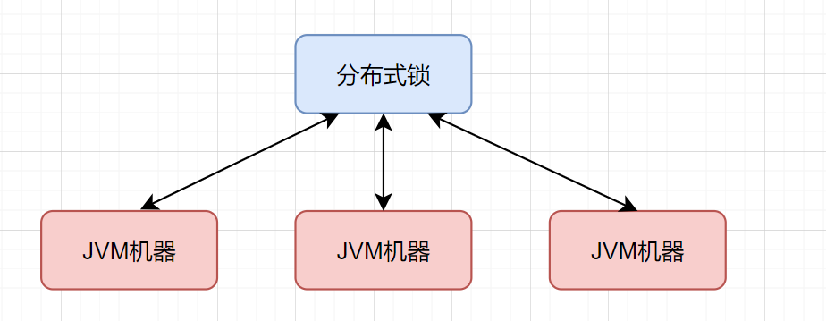

## 分布式锁的原理与实现

分布式锁的目的是区别于JVM单机锁。

JVM单机锁就是在同一个JVM中的锁。比如你使用了synchronized关键字，那么就是在这同一个JVM中，同一时刻只能有一个线程持有锁，其他线程只能等待。但是当你的后端服务式多个机器的集群部署方式，那么JVM单机锁就无法满足需求了。因为你这个JVM锁住了，我的线程打到了另一台机器上，那就相当于没锁住，所以我们需要分布式锁。分布式锁的目的就是在多个JVM层之前设置的锁，这样就可以在多个机器上实现同一把锁的目的。



分布式锁的原理就是在多个机器上设置同一把锁，这个锁通常通过某些中间件实现。当一个线程想要获取锁的时候，首先会去尝试获取锁，如果获取成功，那么就可以执行任务，如果获取失败，那么就只能等待，直到锁被释放。

### MySQL

#### 基于索引

基于索引的实现，是通过在数据库的某个字段上加了唯一的索引，那么只有一个线程能够对写入同一个数据，其他的线程由于索引的唯一性而无法写入，只能等待资源释放——这个唯一值被DELETE掉，那么可以重新写入来获取锁

我们可以先创建一个类似的表：

```sql
CREATE TABLE `database_lock` (
 `id` BIGINT NOT NULL AUTO_INCREMENT,
 `resource` int NOT NULL COMMENT '锁定的资源',
 `description` varchar(1024) NOT NULL DEFAULT "" COMMENT '描述',
 PRIMARY KEY (`id`),
 UNIQUE KEY `uiq_idx_resource` (`resource`) 
) ENGINE=InnoDB DEFAULT CHARSET=utf8mb4 COMMENT='数据库分布式锁表';

```

其中的resource就是锁的名字，locked_at就是锁的创建时间。

这里我们给数据库加了一个唯一索引，目的是对资源进唯一性约束。这样在写入同一个数据时，只能有一个线程写入，其他线程只能失败。通过这样的方法就实现了一个分布式锁。

这种锁的实现比较简单，但也会面临锁无法过期，锁的可靠性依赖于MySQL数据库的可用性等等问题。

#### 基于乐观锁

基于乐观锁的实现原理是多个线程可以同时对资源进行修改，但最终只能有一个修改成功，其他的回退。乐观锁的实现一般是基于版本号的机制，比如在更新数据时，先获取当前版本号，然后更新数据，再更新版本号。如果更新失败，说明数据已经被其他线程更新过了，那么就需要重试。

例如建立如下的数据库表：

```sql
CREATE TABLE `optimistic_lock` (
 `id` BIGINT NOT NULL AUTO_INCREMENT,
 `resource` int NOT NULL COMMENT '锁定的资源',
 `version` int NOT NULL COMMENT '版本信息',
 `created_at` datetime COMMENT '创建时间',
 `updated_at` datetime COMMENT '更新时间',
 `deleted_at` datetime COMMENT '删除时间', 
 PRIMARY KEY (`id`),
 UNIQUE KEY `uiq_idx_resource` (`resource`) 
) ENGINE=InnoDB DEFAULT CHARSET=utf8mb4 COMMENT='数据库分布式锁表';
```

每个线程的执行逻辑如下：

- 获取资源： SELECT resource, version FROM optimistic_lock WHERE id = 1
- 执行业务逻辑
- 更新资源：UPDATE optimistic_lock SET resource = resource -1, version = version + 1 WHERE id = 1 AND version = oldVersion

通过比对修改后的version和修改之前的oldVersion，如果一致，说明数据没有被其他线程更新过，那么就更新成功，否则就需要重试。

这种锁的实现比较复杂，但也能保证数据的一致性。在检测数据冲突时并不依赖数据库本身的锁机制，不会影响请求的性能。但是需要对表的设计增加额外的字段，增加了数据库的冗余。并且高并发的情况下增加了重试的次数，会影响性能。

#### 基于悲观锁

基于悲观锁的实现原理是多个线程只能一个一个地获取锁，直到获取锁的线程释放锁，其他线程才能获取锁。我们在基于MySQL的悲观锁的实现中，一般采用MySQL自带的锁机制，比如SELECT ... FOR UPDATE。数据库会在查询的过程中加上排他锁，那么这样别的事务就无法对该资源进行修改。

基于悲观锁的实现过程如下：

- 获取资源： SELECT * FROM optimistic_lock WHERE id = 1 FOR UPDATE
- 执行业务逻辑
- 释放资源：COMMIT

相当于我们基于SELECT ... FOR UPDATE获取了这行数据的锁，并且在同一事务下执行修改的业务逻辑，最终在COMMIT提交事务时释放锁。

这种锁的的实现也比较简单，主要是基于数据库的事务和行锁。但要注意行锁失效的情况。并且每次请求都会额外产生加锁的开销且未获取到锁的请求将会阻塞等待锁的获取，在高并发环境下，容易造成大量请求阻塞，影响系统可用性。

### Zookeeper

### Redis

### Redisson

## 分布式锁的使用场景


### 参考文献

[基于MySQL实现的分布式锁](https://blog.csdn.net/u013474436/article/details/104924782)
[【MySQL】优雅的使用MySQL实现分布式锁](https://blog.csdn.net/weixin_45683778/article/details/144564485)